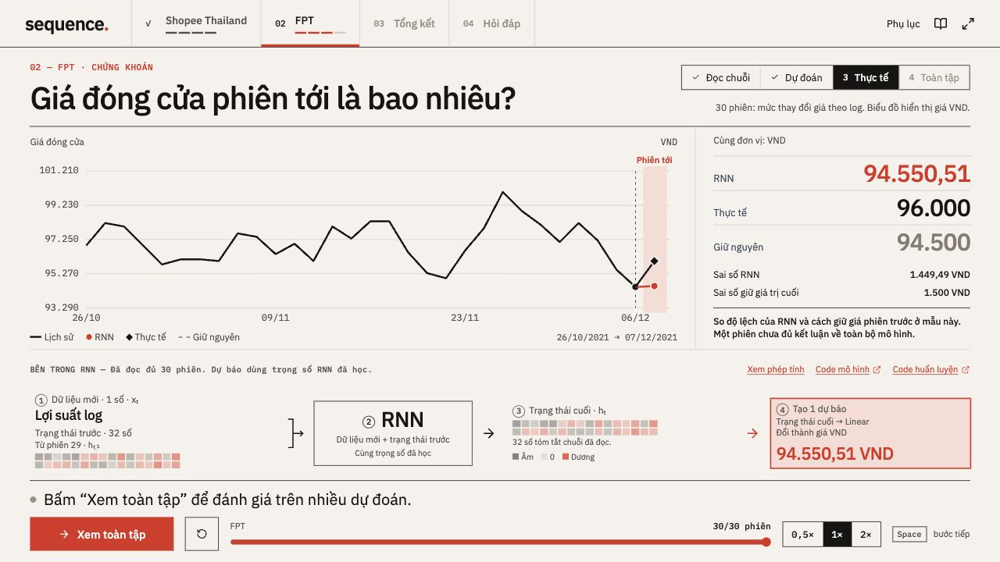
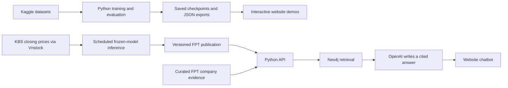

# Sequence · RNN on real-world tasks

An interactive learning project for **Assignment 6**: forecast daily orders from a synthetic Shopee Thailand dataset, explore historical FPT stock forecasts, and ask a Vietnamese-language chatbot about FPT using model outputs and cited evidence.

[Open the live app](https://sequence-rnn.vercel.app) · [English code guide](docs/CODE_GUIDE.md) · [Tiếng Việt](README.vi.md) · [Deployment guide](models/hosting/README.md)

## Watch the walkthrough

[](docs/media/sequence-walkthrough.mp4)

[Watch or download the 40-second walkthrough (MP4)](docs/media/sequence-walkthrough.mp4). The silent video uses English captions, text transitions and moving highlights over fixed screenshots of the Vietnamese interface. Screenshots were captured on October 10, 2026. Their prices and predictions are recorded examples, not live quotes.

## Explore the website

| Chapter | What to try |
| --- | --- |
| [01 · Shopee demo](https://sequence-rnn.vercel.app/#demo) | Follow 30 days of customer activity through an RNN to predict the next day's order count. |
| [02 · FPT demo](https://sequence-rnn.vercel.app/#fpt) | Follow 30 stock returns through an RNN and compare its next-session price estimate with the observed close. |
| [03 · Results](https://sequence-rnn.vercel.app/#tong-ket) | Compare the RNN with a simple baseline on each complete historical test set. GRU results are available in the appendix and saved result files. |
| [04 · Ask about FPT](https://sequence-rnn.vercel.app/#hoi-dap) | Ask a question in everyday language, then open the cited sources to inspect the evidence. |

In each demo, start playback and watch **input → RNN → updated hidden state**. Playback stops at the prediction. Reveal **Thực tế** (actual value) and **Toàn tập** (full test set) manually. Only the selected demo runs. The appendix contains calculations, training history and links to the Python code.

### FPT sequence demo



### FPT chatbot


Example questions:

- “Tôi có 200 triệu, nên đầu tư như thế nào?” — “I have 200 million VND. How should I approach investing?”
- “Nếu giữ FPT khoảng 6 tháng, bạn đánh giá thế nào?” — “How would you assess holding FPT for about six months?”
- “Dữ liệu bạn đang dùng cập nhật đến ngày nào?” — “What is the latest date in your data?”

The chatbot combines FPT forecasts with curated company information. It answers in plain language by default; technical metrics appear when asked. It covers FPT, not a portfolio of Vietnamese stocks, and does not place trades.

## What runs where?

The classroom demos and the chatbot use **separate saved experiments**. The browser replays exported calculations; it does not train a neural network.



**RNNs produce numerical forecasts. The language model explains retrieved evidence.** Neo4j connects forecasts to their stock, input snapshot, model run, evaluation and sources. Retrieval uses full-text search and graph traversal. See the [code guide](docs/CODE_GUIDE.md#4-how-a-chat-answer-is-produced) for the implementation.

The frontend uses React, TypeScript and Vite; the backend uses Python, PyTorch and FastAPI. The public app runs on Vercel, Render and Neo4j Aura. Hosting uses free tiers; OpenAI API usage is separately metered.

## Datasets and honest results

| Historical experiment | Input → target | Train / validation / test windows |
| --- | --- | ---: |
| Shopee Thailand simulation | 30 days × 5 daily behavior counts → next-day orders | 1,001 / 214 / 216 |
| FPT from Kaggle | 30 sessions × 1 log return → next-session closing price | 1,810 / 388 / 389 |

Shopee's features are session starts, product-page visits, cart-page visits, checkout-page visits and orders. These are population-level daily counts; cart-page visits are not confirmed add-to-cart events. The source is **100% synthetic data from an independent publisher**, not official Shopee records or Vietnamese customer data.

Each dataset has a separate RNN and GRU. Both use one recurrent layer, a 32-value hidden state and a linear output. Training uses chronological 70/15/15 target splits, training-only normalization and validation-based early stopping. The [code guide](docs/CODE_GUIDE.md#1-historical-training-pipeline) explains the sequence from raw files to evaluation.

| Historical test set | RNN MAE | GRU MAE | Previous-value baseline MAE |
| --- | ---: | ---: | ---: |
| Shopee · orders/day | 309.75 | 299.74 | **141.56** |
| FPT · VND/share | 1,059.92 | 1,058.94 | **1,053.73** |

MAE is the average absolute difference between prediction and observation; lower is better. **Neither neural model beats the previous-value baseline on MAE in these saved experiments.** Results come from one seed and one chronological split. Errors in different units cannot be compared directly. The separate daily and longer-horizon FPT models are also experimental; their outputs do not establish profitable investment performance.

Sources and attribution:

- [Shopee TH Customer Journey & Operations](https://www.kaggle.com/datasets/hninshwezinhlaing/shopee-th-customer-journey-and-operations-dataset) — Hnin Shwe Zin Hlaing, version 1, CC BY-SA 4.0. Three source tables contain 500,000 sessions, 2,696,481 activities and 300,000 orders.
- [VN30 stock dataset](https://www.kaggle.com/datasets/thangtranquang/stock-vn30-vietnam) — Thang Tran, version 1, CC0. This project uses its FPT series for the historical demo.
- Updated FPT forecasts use **KBS closing prices through Vnstock**, separately from the Kaggle experiment. Corporate-action adjustment is not confirmed by this adapter; the project preserves the supplied price basis.

The [source manifest](models/data/source_manifest.json) records dataset provenance, schemas, licenses and hashes. Raw CSV downloads are excluded from Git and the source ZIP. Processed teaching data, model checkpoints and saved evaluation results are included.

## Automatic FPT closing updates

The [GitHub Actions workflow](.github/workflows/update-fpt.yml) runs at **16:30 and 18:30 Vietnam time, Monday–Friday**. It fetches completed FPT closes, validates them, then uses the saved daily and 1/3/6-month models to publish a consistent set of forecasts. **An update runs inference; it does not retrain the models.**

The hosted API checks the [published bundle](website/public/data/fpt-published.json) on startup and at most every five minutes while in use. Holidays or unavailable data retain the last valid publication and its actual closing date. GitHub schedule times are best effort. Run **Update FPT daily data → Run workflow** in [Actions](https://github.com/albert2704/RNN-Shopee-Customer-Behavior-and-FPT-Stock/actions/workflows/update-fpt.yml) to request a manual update.

The historical teaching charts stay fixed so their results remain reproducible. Scheduled price updates do not automatically refresh the curated company disclosures. See [deployment and operations](models/hosting/README.md#automatic-closing-price-updates).

## Run locally

### Website only

Use Node.js 22.12 or later. From the repository root:

```sh
cd website
npm ci
npm run build
npm run preview -- --port 4173 --strictPort
```

Open [localhost:4173](http://127.0.0.1:4173/#demo). The saved demos and results work without Python. Chat requires the backend described below. For frontend development, use `npm run dev -- --port 4173 --strictPort` instead of the preview command.

### Python models and verification

Use Python 3.12. In another terminal, from the repository root:

```sh
cd models
python3.12 -m venv .venv
source .venv/bin/activate
python -m pip install -r requirements.txt
python src/experiments.py --verify-only --no-write
python scripts/independent_audit.py --skip-raw --no-write
```

These commands check the saved artifacts without retraining. To download the original datasets and train again:

```sh
python scripts/download_data.py
python src/experiments.py --dataset shopee
python src/experiments.py --dataset fpt
```

Retraining replaces the corresponding local processed data, checkpoints and results. Hardware or library differences may produce numerical differences. To regenerate the website exports afterward, run from the repository root:

```sh
python website/scripts/export_data.py shopee fpt
python website/scripts/export_demo.py
python website/scripts/package_source.py
```

### Full chatbot locally

Start Docker Desktop for a local Neo4j database. From `models/`, with the Python environment activated:

```sh
python -m pip install -r chat/requirements.txt
python -m daily.pipeline bootstrap
python -m chat.setup
```

The setup command creates the local Neo4j container and an ignored `models/.env`. Add your `OPENAI_API_KEY` there using an editor, then start the API:

```sh
python -m daily.api
```

Keep the website running in the other terminal and open [Hỏi đáp](http://127.0.0.1:4173/#hoi-dap). Vite proxies `/api` to `127.0.0.1:8006`. API keys and database passwords belong only in the backend environment; never place them in a `VITE_*` variable. Use the [cloud deployment guide](models/hosting/README.md) for Aura and hosted API configuration.

## Repository map

| Path | Contents |
| --- | --- |
| [`models/src/`](models/src/) | Shared preprocessing, RNN/GRU architecture, training and evaluation |
| [`models/data/`](models/data/) | Source manifest and processed teaching datasets; raw downloads are ignored |
| [`models/checkpoints/`](models/checkpoints/) and [`models/results/`](models/results/) | Saved historical weights, predictions, metrics and provenance |
| [`models/daily/`](models/daily/) | KBS data adapter, next-session FPT pipeline, publication validation and API |
| [`models/outlook/`](models/outlook/) | Separate direct forecasts for 21, 63 and 126 trading sessions |
| [`models/chat/`](models/chat/) | Evidence corpus, Neo4j retrieval and cited language-model answers |
| [`models/hosting/`](models/hosting/) | Docker deployment, production startup and security configuration |
| [`website/src/`](website/src/) | Demo playback, charts, explanations and chatbot UI |
| [`website/public/data/`](website/public/data/) | Exported demo data and published FPT forecasts |
| [`docs/`](docs/) | English code guide, website screenshots and walkthrough video |

For a presentation, start with the [English code guide](docs/CODE_GUIDE.md), [Vietnamese source map](models/CODE_MAP_VI.md) or [Vietnamese presentation guide](website/PRESENTATION_GUIDE.md).
