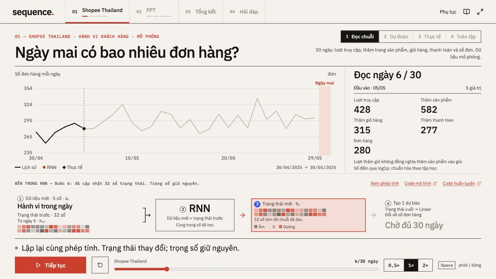
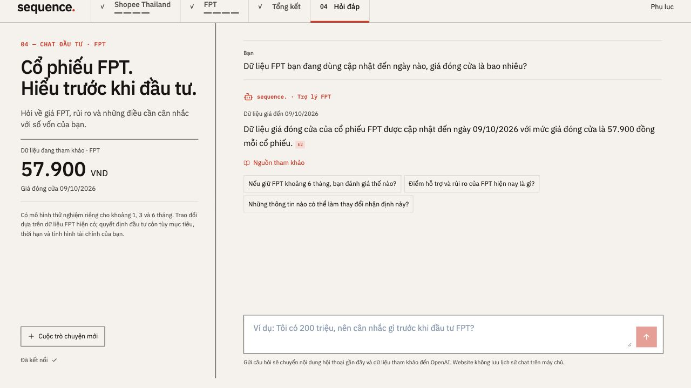

# Sequence · RNN với Shopee Thailand và cổ phiếu FPT

Website của Assignment 6 gồm hai demo chuỗi thời gian, phần so sánh kết quả và chatbot hỏi đáp về FPT bằng tiếng Việt.

[Mở website](https://sequence-rnn.vercel.app) · [English README](README.md) · [Bản đồ code tiếng Việt](models/CODE_MAP_VI.md) · [Hướng dẫn code tiếng Anh](docs/CODE_GUIDE.md)

## Xem nhanh

[](docs/media/sequence-walkthrough.mp4)

[Xem hoặc tải video giới thiệu 40 giây (MP4)](docs/media/sequence-walkthrough.mp4). Video có chú thích tiếng Anh, chuyển động chữ và khung đánh dấu trên ảnh cố định, không có âm thanh.

- **01 Shopee:** đọc 30 ngày hoạt động để dự báo số đơn ngày tiếp theo.
- **02 FPT:** đọc 30 lợi suất để dự báo giá đóng cửa phiên kế tiếp trong thí nghiệm lịch sử.
- **03 Tổng kết:** đối chiếu RNN và cách đoán đơn giản trên toàn tập kiểm tra. Kết quả GRU nằm trong phụ lục và các tệp kết quả đã lưu.
- **04 Hỏi đáp:** giải thích dự báo FPT và thông tin doanh nghiệp bằng câu trả lời có nguồn.

Demo chỉ chạy tập đang chọn. Sau khi đọc chuỗi, website dừng ở dự đoán; bấm **Xem thực tế** và **Xem toàn tập** khi sẵn sàng trình bày. Phụ lục có phép tính, lịch sử huấn luyện và liên kết mã nguồn.



Ảnh được chụp ngày 10/10/2026. Ảnh và video ghi lại một thời điểm, không phải bảng giá trực tiếp.

## Mô hình và dữ liệu

Mỗi tập Kaggle được huấn luyện riêng với RNN và GRU. Mỗi mạng có một lớp truy hồi, trạng thái 32 số và đầu ra `Linear(32, 1)`. Chia train/validation/test theo thời gian 70/15/15; scaler chỉ dùng train; chọn checkpoint bằng validation.

| Thí nghiệm | Đầu vào → mục tiêu | Số cửa sổ train / validation / test |
| --- | --- | ---: |
| Shopee Thailand mô phỏng | 30 ngày × 5 số đếm hành vi → số đơn ngày sau | 1.001 / 214 / 216 |
| FPT Kaggle | 30 lợi suất log → giá đóng cửa phiên sau | 1.810 / 388 / 389 |

Shopee dùng **100% dữ liệu mô phỏng** của một tác giả độc lập, không phải dữ liệu chính thức của Shopee hoặc khách hàng Việt Nam. Nguồn: [Shopee TH Customer Journey & Operations](https://www.kaggle.com/datasets/hninshwezinhlaing/shopee-th-customer-journey-and-operations-dataset), Hnin Shwe Zin Hlaing, phiên bản 1, CC BY-SA 4.0. FPT lịch sử lấy từ [VN30 trên Kaggle](https://www.kaggle.com/datasets/thangtranquang/stock-vn30-vietnam), Thang Tran, phiên bản 1, CC0. Xem [manifest nguồn](models/data/source_manifest.json).

Trong kết quả đã lưu, cả RNN và GRU đều có MAE cao hơn cách giữ giá trị trước đó trên hai tập. Đây là một seed và một lần chia dữ liệu, không chứng minh lợi thế dự báo hay lợi nhuận đầu tư. Không so trực tiếp MAE của số đơn với MAE tính bằng VND.

## Chatbot và cập nhật FPT

Chatbot dùng các mô hình FPT **riêng**, lấy giá KBS qua Vnstock. Có dự báo phiên kế tiếp và ba mô hình trực tiếp cho 21/63/126 phiên, tương đương khoảng 1/3/6 tháng. RNN tạo số dự báo; Neo4j nối dự báo với dữ liệu, mô hình, đánh giá và nguồn; OpenAI diễn đạt câu trả lời dựa trên bằng chứng được truy xuất.

[GitHub Actions](.github/workflows/update-fpt.yml) chạy lúc **16:30 và 18:30, thứ Hai–thứ Sáu, giờ Việt Nam**. Tác vụ lấy giá đóng cửa đã hoàn thành rồi suy luận bằng trọng số đã lưu, không huấn luyện lại mỗi ngày. API lấy bản công bố mới; nếu nguồn lỗi hoặc không có phiên mới, giữ bản hợp lệ trước đó và hiển thị đúng ngày giá. Lịch chạy có thể chậm so với giờ dự kiến. Các demo Kaggle vẫn giữ dữ liệu lịch sử; thông tin doanh nghiệp được biên soạn riêng, không tự cập nhật theo giá.

Website chạy trên Vercel, API trên Render và graph trên Neo4j Aura. Hỏi đáp cần backend; bản HTML tĩnh riêng không tự chạy Python. Hướng dẫn triển khai: [Cloud deployment](models/hosting/README.md).

## Chạy website

Dùng Node.js 22.12 trở lên. Từ thư mục repository:

```sh
cd website
npm ci
npm run build
npm run preview -- --port 4173 --strictPort
```

Mở [demo cục bộ](http://127.0.0.1:4173/#demo). Để chạy Python, kiểm chứng kết quả, huấn luyện lại hoặc cấu hình chat, xem các lệnh hiện hành trong [English README](README.md#run-locally). Key và mật khẩu chỉ nằm trong môi trường backend, không đưa vào Git hoặc biến `VITE_*`.

## Đọc mã nguồn

`models/` chứa Python, dữ liệu đã xử lý, checkpoint và kết quả; `website/` chứa giao diện và JSON xuất từ mô hình. CSV gốc tải vào `models/data/raw/` nhưng không đưa vào Git hoặc ZIP. [CODE_MAP_VI.md](models/CODE_MAP_VI.md) chỉ các hàm dùng để giải thích trên lớp; [CODE_GUIDE.md](docs/CODE_GUIDE.md) mô tả bằng tiếng Anh toàn bộ luồng từ dữ liệu đến câu trả lời.
