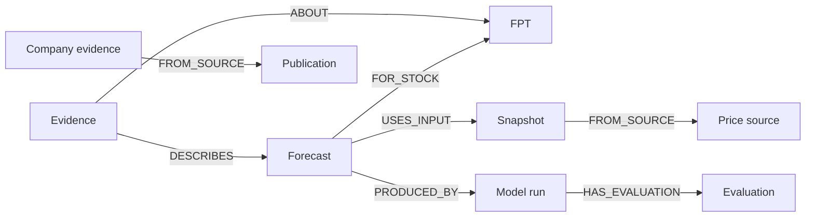

# English code guide

[Back to README](../README.md) · [Vietnamese source map](../models/CODE_MAP_VI.md)

This guide follows the executable code from data to prediction to website. There are two paths: the **fixed Kaggle experiments** used in the teaching demos and the **updated FPT forecasts** used by the chatbot. Their datasets, checkpoints and evaluation results are separate.

## 1. Historical training pipeline

### Step 1 — Obtain the datasets

[`download_data.py`](../models/scripts/download_data.py) downloads the source files. [`source_manifest.json`](../models/data/source_manifest.json) records their publishers, versions, licenses, schemas and hashes.

| Location | What is stored |
| --- | --- |
| `models/data/raw/` | Downloaded Kaggle CSVs, excluded from Git |
| [`models/data/processed/`](../models/data/processed/) | Cleaned daily series and NumPy windows for train/validation/test |
| [`models/checkpoints/`](../models/checkpoints/) | Saved weights plus model configuration and normalization statistics |
| [`models/results/`](../models/results/) | Predictions, loss histories, metrics and source snapshots |

Shopee uses orders, website sessions and session activities. FPT uses historical closing prices. Downloading a dataset does not train a model.

### Step 2 — Validate and clean before splitting

[`prepare_shopee()`](../models/src/preprocessing.py#L11) checks required fields, unique identifiers, timestamps, session links and activity boundaries. Invalid required data raises an error instead of being silently repaired. It aggregates complete source calendar days in 2022–2025 and excludes activity starts outside that range. The retained dataset has 1,461 daily rows.

[`prepare_fpt()`](../models/src/preprocessing.py#L108) removes exact duplicate rows, sorts dates and removes redundant records with identical date/OHLCV values. Conflicting prices for a date are rejected. Closing prices must be finite and positive. It keeps positive closes even when unused OHLC fields are inconsistent and records those anomalies. It does not interpolate weekends, invent adjusted prices or discard large returns automatically.

For the saved FPT source, 2,706 rows become 2,618 closing observations after removing 87 exact duplicates and one redundant daily record. The first close has no preceding close, so the return series has 2,617 rows.

### Step 3 — Build useful inputs and targets

The same functions create transformed values:

| Dataset | Input at each time step | Target |
| --- | --- | --- |
| Shopee | `log1p` of sessions, product visits, cart visits, checkout visits and orders | `log1p` of next-day orders |
| FPT | `log(Close[t] / Close[t-1])` | Next-session log return |

`log1p(x)` means `log(1 + x)`, so zero counts remain valid. A log return expresses proportional price change. The final FPT forecast is converted back to VND.

### Step 4 — Split chronologically

[`prepare_data()`](../models/src/preprocessing.py#L182) lists eligible target positions after the 30-step lookback. The block beginning at [line 195](../models/src/preprocessing.py#L195) assigns the earliest 70% to training, the next 15% to validation and the remainder to test.

- **Training:** examples used to change weights.
- **Validation:** later examples used to select the checkpoint and decide when to stop.
- **Test:** final held-out targets used to report performance after the checkpoint is fixed.

The entire series is not randomly shuffled before splitting. The boundaries are based on the target date. An earlier observed validation/test value can appear in the history of a later forecast; the target being predicted is always excluded from its own input.

### Step 5 — Normalize using training data only

In [`prepare_data()`](../models/src/preprocessing.py#L209), feature means and standard deviations use only the training time region, including available lookback context. Target statistics use only training targets. Those saved statistics transform validation and test data too.

This prevents future observations from influencing the scale learned during training. A normalized value is `(value - training_mean) / training_std`; normalization is separate from the earlier log transform.

### Step 6 — Create sliding windows

The window loop in [`prepare_data()`](../models/src/preprocessing.py#L221) uses `scaled_x[t - lookback : t]`. Python excludes the right endpoint, so the model reads 30 past rows and predicts row `t`.

Inputs have shape `(B, L, F)`: batch size, sequence length, feature count. Shopee has `(B, 30, 5)` and FPT has `(B, 30, 1)`. Targets have shape `(B, 1)`.

### Step 7 — Define the RNN or GRU

[`RecurrentForecaster`](../models/src/models.py#L6) creates `nn.RNN` or `nn.GRU`, followed by `nn.Linear(hidden_size, 1)`. [`forward()`](../models/src/models.py#L27) reads the sequence and converts the last hidden state into one prediction.

An RNN repeatedly combines the current input with a summary of earlier inputs. This summary is the **hidden state**. Here it contains **32 learned numerical features**; 32 is the chosen capacity, not the number of days, input columns or epochs. Its components do not have assigned labels such as “risk” or “price.” GRU adds gates that control how state information is retained and updated.

Each window starts with a zero hidden state. The state changes at each time step, while the same recurrent weights are reused throughout the window. During inference the weights stay fixed; during training they are updated between batches.

### Step 8 — Train by correcting prediction errors

[`fit_model()`](../models/src/training.py#L31) creates the model, Adam optimizer and mean squared error (MSE) loss. Its batch loop performs:

```python
optimizer.zero_grad(set_to_none=True)  # Clear gradients from the previous batch.
loss = loss_fn(model(x), y)            # Predict, then measure transformed-space error.
loss.backward()                      # Backpropagate through the sequence.
nn.utils.clip_grad_norm_(model.parameters(), config["gradient_clip_norm"])
optimizer.step()                     # Adam changes the trainable weights.
```

This block is at [`training.py`, line 61](../models/src/training.py#L61). Gradient clipping limits the gradient norm before the update. Shuffling the training loader changes the order of independent windows; it does not shuffle the time steps inside them.

An **epoch** is one pass through all training windows. [`config.py`](../models/src/config.py) sets seed 42, hidden size 32, batch size 64, learning rate 0.001, at most 40 epochs and patience 8. These are fixed settings, not a reported hyperparameter search.

### Step 9 — Choose the checkpoint with validation

After each epoch, [`fit_model()`](../models/src/training.py#L72) predicts validation targets without updating weights. It keeps a copy of the weights with the lowest validation MSE and stops after eight consecutive epochs without improvement. It restores those best weights before saving the `.pt` checkpoint.

“One training run” can contain many epochs. The saved Shopee RNN ran 19 epochs and retained epoch 11; the GRU ran 10 and retained epoch 2. Both historical FPT models ran 9 and retained epoch 1. Test scores do not select these epochs.

### Step 10 — Convert predictions back and evaluate

[`evaluate()`](../models/src/evaluation.py#L51) trains each model through the supplied trainer, then evaluates the chosen checkpoints. [`predict()`](../models/src/evaluation.py#L9) uses evaluation mode and disables gradient tracking.

[`original_units()`](../models/src/evaluation.py#L23) reverses target normalization, then applies:

- Shopee: `max(0, expm1(prediction))` → orders/day.
- FPT: `previous_close * exp(predicted_log_return)` → VND/share.

[`metrics()`](../models/src/evaluation.py#L40) computes MAE and RMSE against actual observations. The same target dates are also scored with simple baselines: previous value for both datasets, same weekday last week for Shopee, and training-mean return for FPT.

The website's **Toàn tập** values come from this evaluation, not just the single illustrated prediction. In the saved experiments, both RNN and GRU have worse MAE than the previous-value baseline. Training MSE is measured in standardized transformed space, while the displayed MAE is measured in orders or VND.

### Step 11 — Save, verify and export

[`experiments.main()`](../models/src/experiments.py#L104) coordinates preparation, training/evaluation, plots and output files. Supporting code:

| File | Responsibility |
| --- | --- |
| [`verification.py`](../models/src/verification.py) | Check saved splits, scalers, metrics and checkpoint hashes |
| [`independent_audit.py`](../models/scripts/independent_audit.py) | Independently reconstruct windows, predictions and metrics; optionally rebuild from raw CSVs |
| [`plots.py`](../models/src/plots.py) | Draw dataset, training, prediction, residual and metric plots |
| [`io_utils.py`](../models/src/io_utils.py) | Write JSON, calculate SHA-256 and preserve source snapshots |
| [`toy_rnn.py`](../models/src/toy_rnn.py) | Separate scalar RNN example with manual BPTT and one SGD update |
| [`export_data.py`](../website/scripts/export_data.py) | Export results for the website's data and learning views |
| [`export_demo.py`](../website/scripts/export_demo.py) | Export checkpoint calculations for the two main RNN replays |

Verification checks consistency and reproducibility; it does not prove useful predictive accuracy. The scalar BPTT example explains the mathematics but is not the architecture trained on either dataset.

## 2. How the website displays the experiments

| File | Responsibility |
| --- | --- |
| [`App.tsx`](../website/src/App.tsx), [`Shell.tsx`](../website/src/Shell.tsx) | Assemble the app and its chapter navigation |
| [`DemoStage.tsx`](../website/src/components/DemoStage.tsx) | Coordinate the active dataset and demonstration |
| [`useDemoPlayback.ts`](../website/src/hooks/useDemoPlayback.ts), [`replayTimeline.ts`](../website/src/domain/demo/replayTimeline.ts) | Control playback, reading progress and reveal phases |
| [`RecurrentMechanism.tsx`](../website/src/components/demo/RecurrentMechanism.tsx) | Show input, recurrent processing and hidden-state flow |
| [`ReplayChart.tsx`](../website/src/components/demo/ReplayChart.tsx) | Plot history, prediction, actual value and baseline |
| [`PhasePanel.tsx`](../website/src/components/demo/PhasePanel.tsx) | Explain the current prediction/evaluation phase |
| [`DemoSummary.tsx`](../website/src/components/demo/DemoSummary.tsx) | Compare RNN and previous-value baseline on complete historical test sets |
| [`StockChat.tsx`](../website/src/components/StockChat.tsx) | Send chat requests and display cited answers |

The browser reads saved JSON under [`website/public/data/`](../website/public/data/). Starting playback changes the visualization state; it does not run an epoch or modify a checkpoint. **Thực tế** and **Toàn tập** are deliberate manual reveals for a presenter.

## 3. Updated FPT data and separate forecast models

The chatbot uses KBS/Vnstock data and separately trained checkpoints, rather than extending the Kaggle teaching experiment.

| Stage | Code | Behavior |
| --- | --- | --- |
| Fetch | [`daily/provider.py`](../models/daily/provider.py), `fetch()` | Request FPT daily closes from KBS via Vnstock and record provenance |
| Validate | [`daily/core.py`](../models/daily/core.py#L17), `clean_closes()` | Convert explicitly supplied price units; reject invalid/conflicting/future records; exclude today's bar before 16:00 Vietnam time |
| Prepare daily training | [`daily/core.py`](../models/daily/core.py#L55), `prepare_windows()` | Create 30-return windows, chronological splits and training-only scalers |
| Train daily | [`daily/pipeline.py`](../models/daily/pipeline.py#L98), `train()` | Call the shared trainer and save an independent run with evidence |
| Forecast daily | [`daily/pipeline.py`](../models/daily/pipeline.py#L235), `make_forecast()` | Load the saved model/scaler and infer from the latest 31 closes |
| Prepare longer horizons | [`outlook/core.py`](../models/outlook/core.py#L27), `prepare_windows()` | Use 60 returns to predict `log(Close[t+h] / Close[t])` for `h = 21, 63, 126` |
| Train longer horizons | [`outlook/pipeline.py`](../models/outlook/pipeline.py#L234), `train()` | Train one independent RNN per horizon |
| Publish updates | [`daily/update_publication.py`](../models/daily/update_publication.py#L11), `update()` | Fetch once, run frozen daily/outlook models and validate a complete publication |
| Consume updates | [`daily/published.py`](../models/daily/published.py), `validate()` / `read()` | Validate the published bundle, cache it and retain the last valid version on failure |

Longer-horizon models predict their horizons directly; they do not repeat the one-day prediction 126 times. Their chronological splits remove boundary examples whose future target would cross into the next evaluation region. One, three and six months are approximate labels for recorded trading-session counts, not exact calendar dates.

The [scheduled workflow](../.github/workflows/update-fpt.yml) runs at 16:30 and 18:30 on weekdays in Vietnam. It commits the daily forecast, outlooks, ledger bundle and source ZIP together when inputs change. The production API reads that publication on startup and at most every five minutes during use. It does not need a daily redeploy, a running developer laptop or daily retraining. Company disclosures are not refreshed by this price task.

The recorded daily and longer-horizon evaluations do not establish an advantage over the unchanged-price baseline. The source does not confirm corporate-action adjustment, so the code preserves the supplied price basis and avoids treating incompatible historical prices as comparable outcomes.

## 4. How a chat answer is produced

The entry point is [`service.answer()`](../models/chat/service.py#L318):

1. Read the latest validated daily forecast with its matching outlooks through [`daily.pipeline.read_latest()`](../models/daily/pipeline.py#L363).
2. Attach curated company information and compatible outlook evidence in [`investment.py`](../models/chat/investment.py). Company snippets live in [`company_evidence.json`](../models/chat/company_evidence.json).
3. Choose plain-language, technical or explicit calculation handling using `reply_mode()` and form a search query from recent user messages.
4. In [`graph.retrieve()`](../models/chat/graph.py#L26), build a versioned corpus with [`evidence.corpus()`](../models/chat/evidence.py#L26), import reference facts into Neo4j and retrieve relevant documents with full-text search plus fixed, parameterized Cypher traversal.
5. Prepare the retrieved evidence and, only for an explicit calculation question, add the calculator result. Merely mentioning a budget does not automatically calculate a share allocation.
6. [`service.generate()`](../models/chat/service.py#L276) sends the retrieved evidence and recent conversation context to OpenAI for a structured answer.
7. Validate the answer structure and citation IDs, then return paragraphs and sources to [`StockChat.tsx`](../website/src/components/StockChat.tsx).

The knowledge graph stores **stock, source, input snapshot, model run, forecast, horizon forecast, evaluation, evidence and publication** nodes. Relationships answer questions such as “Which model produced this forecast?” and “Which data source supports it?”



The graph does not contain neural-network weights, the complete raw training tables, user questions or chat history. It is the reference layer, while model artifacts and source files remain in their own folders. This implementation uses lexical retrieval and graph traversal, not vector embeddings or language-model-generated Cypher.

The UI holds the current conversation in memory. Replies cite retrieved evidence, but citations and structured validation do not guarantee every sentence is correct. Users can open sources to check the underlying date, forecast and limitations.

## 5. Run the relevant checks

For environment setup, see [Run locally](../README.md#run-locally). From `models/` with the Python environment activated:

```sh
python src/experiments.py --verify-only --no-write
python scripts/independent_audit.py --skip-raw --no-write
python -m pip install -r chat/requirements.txt -r daily/requirements-test.txt
python -m unittest hosting.test_hosting chat.test_chat chat.test_investment daily.test_daily daily.test_published outlook.test_outlook
```

From `website/`:

```sh
npm run test:logic
npm run format:check
npm run build
```

Some optional checks need the original private training snapshot or a configured Neo4j instance. Unit tests do not by themselves verify a live language-model answer. A real question through the configured app verifies the end-to-end chat connection.
